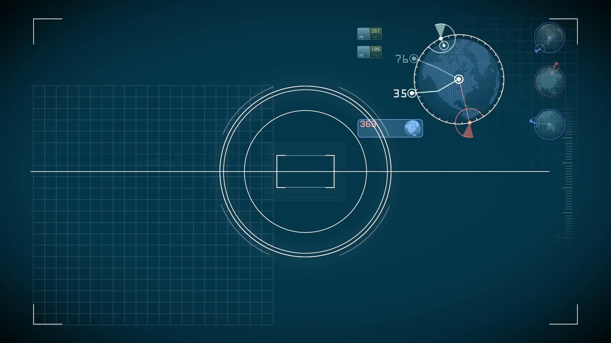

# SciFi UI Project

Name: Richie Meyer

Student Number: C17303563


# Description of the assignment
The assignment we were given was to show our skill with what we learned using Java and Processing. It required us to build a user interface similar to what you would find in movies or games. I used processing in order to create the visuals and Java in order to instanciate classes and make objects.
My project in particular was based off this image:

This was the general layout of how I wanted my user interface to look like. I was not able to succeed in getting the blue tint on the screen or the sprites in the corners. However, for the most part I refered back to this image multiple times while programming the project.

# Instructions
The UI itself is quite simple to operate and shows a ship flying through space and various speeds whilst zooming past stars and planets. In order to control the speed of the ship, the user must simply move their mouse along the X-axis of the UI.

However, the faster the ship is moving, the faster it will consume fuel. If the ship is to run out of fuel it will dramatically slow down and will simply drift through space. In order to refuel the ship, the user must simply press the refuel button at the top of the screen.

# How it works
## UI Class
The UI class is where I starte my project. I began by making a simple canvas and then drawing the UI as shown in the picture above. All line and ellipse code is controlled by variables in order to keep everything relative. For example:
 ```Java
 		line(border, border, border*2, border);
        line(border, border, border, border*2);
        line(border, height - border, border*2, height - border);
        line(border, height - border, border, (height - border) - border);
        line(width - border, border, width - border, border*2);
        line(width - border, border, width - border*2, border);
        line(width - border, height - border, width - border*2, height - border);
        line(width - border, height - border, width - border, height - border*2);

```
These are the lines on the border of the UI that encase the canvas. They were created by adding different operations to the border variable I have.

The UI Class is also where the different classes are instantiated:
```Java
		 radar = new Radar(this, 1, width - border*4, border*4, 100);

        b = new Button(this, border*2, border*2, 200, 50, "Click Here To Refuel");

        fuel = new Fuel(this);
```


## Star Class
The first aspect I started working on in this project was the stars. I watched all the Star Wars movies as a kid and thought it was really cool watching the ships enter hyperspace. I wanted to achieve something similar to this. To start off I created an array of stars and instantiated it like so:
 ```Java
 for(int i = 0; i < stars.length; i++)
        {
            stars[i] = new Star(this, random(-width,width), random(-height, height), random(150));
            
        }
```
The order of parameters here is X, Y and Z. These were all given random values in order to make it look natural.
In order to make the stars look like they are moving I use Z as a divisor and this will make the new X and Y coordinates. This means that decreasing the value of Z the more X and Y increase giving us the illusion of speed. Then, once Z is equal to 1 the stars have passed to borders of the screen. They are then sent back and are given new X and Y coordinates and this continues for the length the program is running. 
I achieved the speed using the *mapping function*. As the mouse gets closer to the value of width, the stars and planets will speed up simultaneously.
Here is the code:
```Java
stars[i].update(map(mouseX, 0, width, 0, 10));
```

In order to get the new Star position I used the following code:
```Java
		float sx = map(x / z, 0, 1, 0, width);
        float sy = map(y / z, 0, 1, 0, height);
```
When we do the division we are left with a very high number. We map this 0 - 1 and this way ensures that the sx and sy coordiantes move faster each time.

In order to give the effect that the stars are getting bigger as they come closer I used:
```Java 
		float r = map(z, 0, width, 6, 0);
		ui.ellipse(sx, sy, r, r);	
```
The Z value is used to increase the star size from a range of 0, 6.

## Planet Class
The planets work similarly to this also. However, instead of having an array of planets, I just instantiate a new planet every time one has left the screen. I also loaded in a file in order to name the planets.

The planets are also given a different random RGB colour every time they pass. I achieved this by using this code
```Java
        this.r = random(25,50);
        this.g = random(25,50);
		this.b = random(25,50);
		
		ui.fill(r,g,b);
```

## Radar Class
The Radar class is used in order to track the position of the planets passing by the ship. A PVector is used in order to hold the position of the radar. The values are then sent as parameters to this UI Class.
Then in order to create the line rotating around the circle I used the built in maths operators and a variable angle theta. Here is the code used to draw the circle and rotating line:
```Java
		ui.noFill();
        ui.stroke(255);
        ui.ellipse(pos.x, pos.y, radius * 2, radius * 2);
        float x2 = pos.x + (float) Math.sin(theta) * radius;
        float y2 = pos.y - (float) Math.cos(theta) * radius;
        ui.stroke(0, 255, 50);
        ui.line(pos.x, pos.y, x2, y2);
```
In update is where the angle theta changes which gives the line the ability to move around the circle: 
```Java
	theta += PApplet.TWO_PI * timeDelta * frequency;
```

## Button Class
This class was used to hold all the variables for the button on the type left of the screen which allows the user to refuel the ship. This was one of the more simple classes that I used as it does not use a update function.
The class takes several parameters in order to show and print the button. These parameters includes a string, width, height, x, and y values.
Here is the render code for the Button Class.
```Java
		ui.noFill();
        ui.stroke(colour);
        ui.rect(x, y, width, height);
        ui.textAlign(PApplet.CENTER, PApplet.CENTER);
		ui.text(text, x + width * 0.5f, y + height * 0.5f);
```
## Fuel CLass
This class draws and holds the variables that control the fuel element of the UI. The drawing code was completed by using several lines. I also added small measurements on the side of the fuel gauge in order to make it look more realistic. This was completed through using a forloop. Here is the code that was used: 
```Java
		float current = 0;
		current = gap;
        for(int i = 0; i < measurement; i++)
        {
            ui.strokeWeight(2);
            ui.line(ui.width - ui.border * 5, ui.height - ui.border * 7 + gap, ui.width - ui.border * 5 + 15, ui.height - ui.border * 7 + gap);
            gap = gap + current;
        }
```
The update function holds the currentFuel variable which slowly *increases* as the ship gets faster. It slowly increases because the background of the actually fuel gauge is red. As the fuel consumption variable goes up a black rectangle gets bigger which gives the effect that the fuel is going down. 
```Java 
		if(currentFuel < 250)
			{
			currentFuel += currentConsumption;
			}
			else
			{
				currentFuel = 250;
			}
```

# What I am most proud of in the assignment
Throughout the course I struggled with some of the key aspects of object oriented programming. This assignment and experimenting with classes has really improved my ability in understanding how OO programming works. With that being said, I am most proud of the planet class and the fuel class. Throughout programming both of these classes I had to constanly pass values to and from different classes in order to get the key elements to work such as planet speed or fuel consumed. Understanding how these worked, making mistakes and fixing them really gave me a sense of joy once completed. A good example of my problem solving was the fuel gauge problem. When I tried to get the red rectangle to shrink, it would shrink from bottom to top instead of top to bottom. In order to solve thus problem I had to get creative. This is the code I used in order to solve the problem:
```Java
		ui.fill(153,0,0);
        ui.rect(ui.width - ui.border*5, ui.height - ui.border*7, ui.border*2, (ui.height - ui.border * 2) - (ui.height - ui.border * 7));

        ui.fill(0);
        ui.rect(ui.width - ui.border*5, ui.height - ui.border*7, ui.border*2, currentFuel);
        ui.noFill();	
```
The second rectangle (black one) is the one that actually moves, not the red one. We can see this because the height variable 'currentFuel'. This value starts at 0 and as the speed of the ship increases or  decreases the currentFuel value is increased depending on the speed of the ship. Then once the fuel is 'empty' and the button is pressed, the currentFuel value is set back to 0. 
# SciFI Video
[](https://www.youtube.com/watch?v=BuNp8TyxGps&feature=youtu.be)
# Markdown Tutorial

This is *emphasis*

This is a bulleted list

- Item
- Item

This is a numbered list

1. Item
1. Item

This is a [hyperlink](http://bryanduggan.org)

# Headings
## Headings
#### Headings
##### Headings

This is code:

```Java
public void render()
{
	ui.noFill();
	ui.stroke(255);
	ui.rect(x, y, width, height);
	ui.textAlign(PApplet.CENTER, PApplet.CENTER);
	ui.text(text, x + width * 0.5f, y + height * 0.5f);
}
```

So is this without specifying the language:

```
public void render()
{
	ui.noFill();
	ui.stroke(255);
	ui.rect(x, y, width, height);
	ui.textAlign(PApplet.CENTER, PApplet.CENTER);
	ui.text(text, x + width * 0.5f, y + height * 0.5f);
}
```

This is an image using a relative URL:


This is an image using an absolute URL:


This is a youtube video:

[](https://www.youtube.com/watch?v=J2kHSSFA4NU)

This is a table:

| Heading 1 | Heading 2 |
|-----------|-----------|
|Some stuff | Some more stuff in this column |
|Some stuff | Some more stuff in this column |
|Some stuff | Some more stuff in this column |
|Some stuff | Some more stuff in this column |

